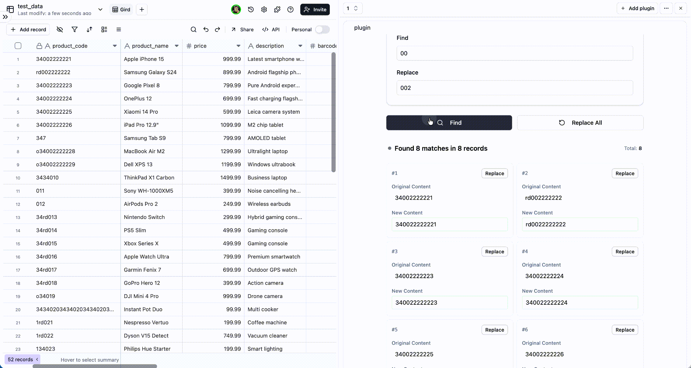

# Teable 查找替换插件

<div align="center">



一个 [Teable](https://teable.ai) 插件，为表格记录提供高效的查找和替换功能，支持多种搜索模式和批量处理。

[](https://opensource.org/licenses/MIT)
[](https://nextjs.org/)
[](https://www.typescriptlang.org/)
[](https://reactjs.org/)

</div>

## ✨ 功能特性

- 🔍 **多种搜索模式** - 简单文本、正则表达式和字典批量搜索，性能提升3倍
- 🎯 **字段选择** - 灵活的字段选择，实现精准搜索
- 📊 **视图筛选** - 将搜索范围限制在特定的表格视图
- 🔄 **批量处理** - 全部替换或单个替换操作
- 🎨 **现代 UI** - 响应式设计，卡片网格布局，支持明暗主题
- 🌍 **国际化** - 完整的 i18n 支持（英文/中文）
- ⚡ **高性能** - 优化的搜索算法和 React 组件
- 🛡️ **错误处理** - 统一的错误处理系统，提供用户友好的消息
- 🔌 **Teable 集成** - 与 Teable 表格和字段的无缝集成，自动token刷新

## 🛠️ 技术栈

- **Next.js 14.2.14** - 带 App Router 的 React 框架
- **React 18.2.0** - 现代化 React 功能
- **TypeScript 5** - 严格类型安全
- **Tailwind CSS 3.4.1** - 原子化 CSS 样式
- **React Query 4.36.1** - 数据获取和缓存
- **Teable SDK** - 插件集成和组件
- **React i18next** - 国际化支持

## 🚀 快速开始

### 前置要求
- Node.js 18+
- npm 或 yarn
- 具有插件访问权限的 Teable 账户

### 1. 安装依赖
```bash
npm install
```

### 2. 启动开发服务器
```bash
npm run dev
```
访问 [http://localhost:3001](http://localhost:3001) 查看插件。

### 3. 构建生产版本
```bash
npm run build
```

### 4. 启动生产服务器
```bash
npm start
```

### 5. 代码质量检查
```bash
npm run lint          # 运行 ESLint
npm run analyze       # 分析打包大小
```

## 📁 项目结构

```
src/
├── app/                          # Next.js App Router
│   ├── page.tsx                 # 主应用入口，包含 i18n 和主题设置
│   ├── Main.tsx                 # 主题和 QueryClient 集成
│   ├── layout.tsx               # 根布局组件
│   └── globals.css              # 全局样式和 CSS 变量
├── components/
│   ├── FindAndReplacePages.tsx  # 主查找替换界面组件
│   ├── ErrorBoundary.tsx        # 错误边界组件
│   ├── context/                 # React Context 提供者
│   │   ├── EnvProvider.tsx      # 环境变量注入
│   │   ├── I18nProvider.tsx     # 国际化提供者
│   │   ├── getQueryClient.ts    # React Query 客户端设置
│   │   └── types.ts             # TypeScript 类型定义
│   ├── find-replace/            # 查找替换特定组件
│   │   ├── FieldSelector.tsx    # 字段选择组件
│   │   ├── ViewSelector.tsx     # 视图选择组件
│   │   ├── ModeSelector.tsx     # 搜索模式选择
│   │   ├── SimpleModeInput.tsx  # 简单文本搜索输入
│   │   ├── RegexModeInput.tsx   # 正则表达式模式输入
│   │   ├── RegexTester.tsx      # 正则表达式测试工具
│   │   ├── DictionaryModeInput.tsx # 字典模式输入
│   │   ├── DictionaryEditor.tsx # 字典编辑器组件
│   │   ├── SearchResults.tsx    # 搜索结果展示
│   │   └── PreviewTable.tsx     # 预览表格组件
│   └── ui/                      # UI 工具组件
│       └── Icons.tsx            # 图标组件
├── hooks/                       # 自定义 React Hooks
│   ├── useInitApi.ts           # API 初始化
│   ├── useFields.ts            # 字段数据获取
│   ├── useViews.ts             # 视图数据获取
│   ├── useFieldMap.ts          # 字段映射工具
│   ├── useFindReplaceState.ts  # 查找替换状态管理
│   ├── useGlobalUrlParams.ts   # URL 参数管理
│   ├── useToast.ts             # Toast 通知
│   └── useAsyncError.ts        # 异步错误处理
├── lib/                         # 业务逻辑和工具
│   └── api.ts                  # API 客户端工具
├── utils/                       # 工具函数
│   └── findReplace/            # 查找替换工具
│       ├── searchAlgorithms.ts # 搜索算法实现
│       └── ReplaceHandler.ts    # 替换操作处理器
├── types/                       # 全局类型定义
│   └── index.ts                # 类型导出
├── locales/                     # 国际化文件
│   ├── en.json                 # 英文翻译
│   └── zh.json                 # 中文翻译
└── styles/                      # 额外样式
    └── custom-enhancements.css # 自定义 CSS 增强
```

## 🔧 配置

### 插件参数
插件通过 `EnvProvider.tsx` 从 URL 参数读取配置：

- `baseId` - Teable 基础标识符
- `pluginId` - 插件标识符
- `pluginInstallId` - 插件安装 ID
- `tableId` - 查找替换操作的目标表格
- `viewId` - 可选的视图 ID，用于限制搜索范围
- `shareId`, `positionId`, `positionType` - UI 定位
- `lang`, `theme` - 本地化和主题设置

### 搜索模式

插件支持三种搜索模式：

#### 简单模式
- 基本文本搜索和替换
- 区分大小写和整词匹配选项
- 直接文本匹配

#### 正则表达式模式
- 正则表达式模式匹配
- 支持捕获组（$1, $2 等）
- 内置正则测试器用于模式验证
- 包含常用正则表达式模式

#### 字典模式
- 批量搜索和替换操作
- 基于 JSON 的字典格式
- 可视化字典编辑器
- 支持转义字符

## 🎨 样式和主题

### CSS 架构
- **CSS 变量** - 使用 HSL 颜色值的完整主题系统
- **响应式设计** - 移动优先的方法，带断点
- **组件隔离** - 自定义组件的作用域样式
- **暗色模式支持** - 自动主题检测和切换

### UI 组件
- **Shadcn/ui 组件** - 现代、可访问的 UI 组件
- **Teable UI 集成** - 与 Teable 设计系统保持一致
- **表单控件** - 搜索配置的自定义表单元素

## 🌍 国际化

支持的语言：
- 英文 (en)
- 中文 (zh)

### 添加新语言
1. 在 `src/locales/[lang].json` 创建翻译文件
2. 更新 `I18nProvider.tsx` 资源配置
3. 向组件添加特定语言的内容

## 🔌 Teable 集成

### 插件桥接使用
```typescript
import { usePluginBridge } from '@teable/sdk';

const bridge = usePluginBridge();

// 监听配置变化
bridge.on('syncUIConfig', handleConfigChange);

// 获取临时令牌用于 API 调用
const token = await bridge.getSelfTempToken();
```

### API 集成
插件使用 Teable 的 OpenAPI，自动身份验证：
```typescript
import { openApi } from '@teable/openapi';

// 所有 API 调用都自动身份验证
const fields = await openApi.getFields(tableId);
const records = await openApi.getTableRecords(tableId, viewId);
```

## 🔍 搜索算法

插件实现了三种搜索算法：

### 简单搜索
```typescript
// 直接文本匹配，可选区分大小写
// 支持整词匹配
```

### 正则表达式搜索
```typescript
// 完整的正则表达式模式匹配，支持捕获组
// 示例: (\d{3})-(\d{4}) → $1-$2
```

### 字典搜索
```typescript
// 使用键值对进行批量替换
// 格式: { "查找": "替换", "hello": "world" }
```

## 🚀 部署

### 构建过程
```bash
# 构建生产版本
npm run build

# 优化构建
npm run build:optimized
```

### 插件安装
1. 构建插件：`npm run build`
2. 部署到你的托管服务
3. 在 Teable 中配置正确的 URL 参数
4. 在 Teable 环境中测试插件功能

## 🧪 开发

### 代码质量
- **TypeScript 严格模式** - 完整类型安全启用
- **ESLint** - 代码质量和样式强制执行
- **Prettier** - 一致的代码格式化

### 性能功能
- **React Query** - 高效数据获取和缓存
- **React.memo** - 组件优化
- **useMemo/useCallback** - Hook 优化
- **代码分割** - 优化的包加载

## 📝 使用示例

### 简单文本搜索
1. 选择要搜索的字段
2. 选择"文本"模式
3. 输入搜索文本
4. 输入替换文本
5. 点击"查找"进行搜索
6. 查看结果并替换

### 正则表达式搜索
1. 选择要搜索的字段
2. 选择"正则表达式"模式
3. 输入正则表达式模式
4. 使用正则测试器验证模式
5. 输入替换文本（使用 $1, $2 表示分组）
6. 点击"查找"进行搜索
7. 查看结果并替换

### 字典搜索
1. 选择要搜索的字段
2. 选择"字典"模式
3. 在字典编辑器中添加键值对
4. 点击"查找"进行搜索
5. 查看结果并替换

## 🤝 贡献

我们欢迎贡献！请遵循以下步骤：

1. Fork 仓库
2. 创建功能分支：`git checkout -b feature/amazing-feature`
3. 提交更改：`git commit -m 'Add amazing feature'`
4. 推送到分支：`git push origin feature/amazing-feature`
5. 打开 Pull Request

### 开发指南
- 编写全面的 TypeScript 类型
- 为所有公共函数添加英文 JSDoc 注释
- 遵循现有代码风格和模式
- 彻底测试你的更改
- 根据需要更新文档

## 📄 许可证

本项目在 MIT 许可证下发布 - 查看 [LICENSE](LICENSE) 文件了解详情。
